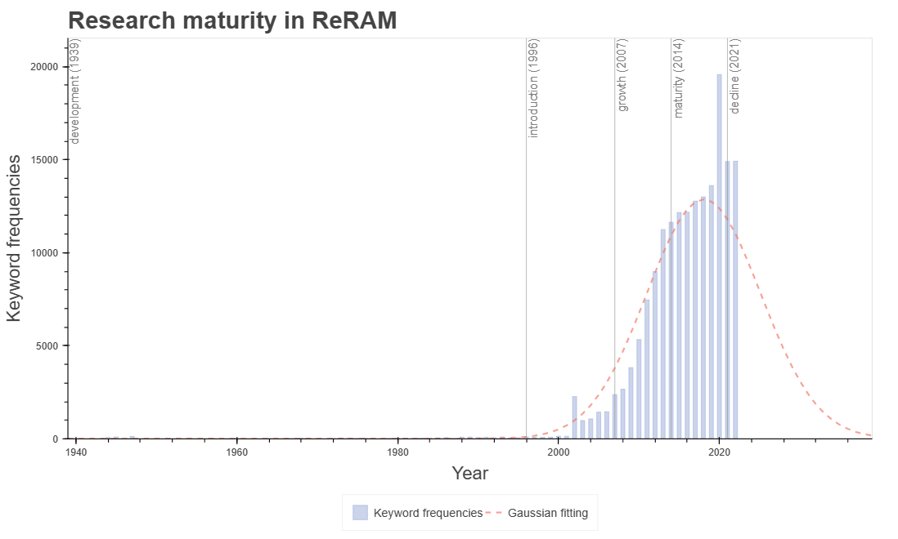
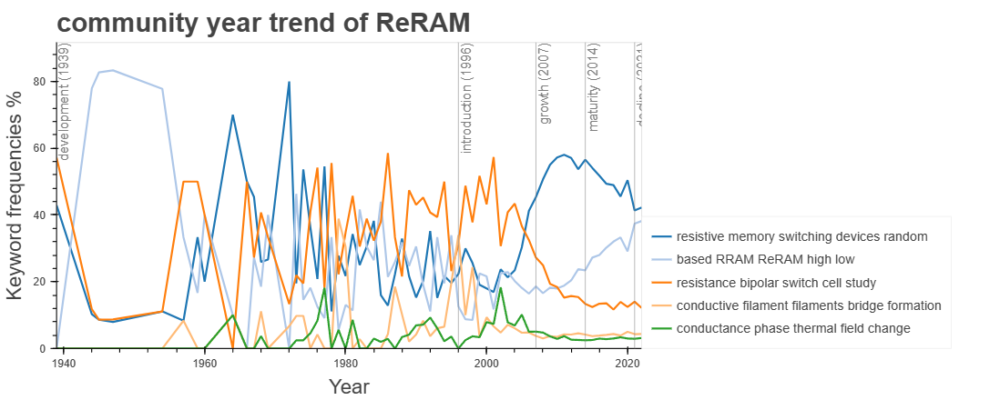
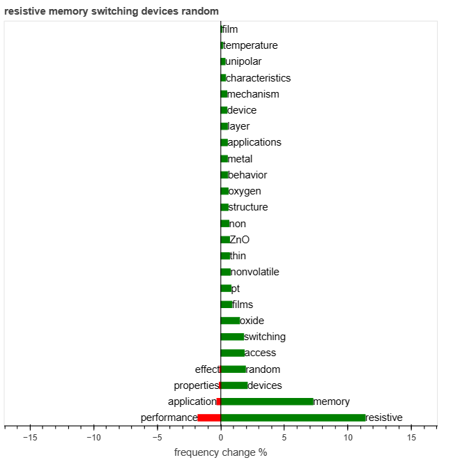

<p align="center">

# Keyword-based Automatic Research Structurization (KARS)
A program that automates the extraction of keywords from scientific research based on bibliographic information, structures the research, and analyzes research trends. It visually presents researchers with the spatial form and temporal flow of their research.

# Installation
## 1. Clone Github repository
    git clone --recurse-submodules https://github.com/khyeon-cnmd/KARS.git

## 2. Setup anaconda
    conda create -n KARS python==3.10
    conda activate KARS

## 3. Install python libraries 
    pip install jsonlines
    pip install gradio==3.47.0
    pip install networkx[default]
    pip install tqdm
    pip install pandas
    pip install scipy
    pip install bokeh
    pip install spacy

## 4. Install spacy dataset
    python -m spacy download en_core_web_sm
    python -m spacy download en_core_web_trf

# 5. Usage
    python KARS_GUI.py

After entering the above command, connect to the localhost server (127.0.0.1) printed on the terminal, and then sequentially execute load_DB -> keyword_extraction -> network_construction -> research_trend_analysis.

# 6. A Keyword-based Approach to Analyzing Scientific Research Trends: ReRAM Present and Future 
6-1. The original metadata used in the Article is ReRAM_DB/KARS/metadata_source.csv, and the parsed version to be compatible with KARS is in the database folder.

6-2. The original keyword network constructed in the Article is ReRAM_DB/KARS/network_article.gephi. The results using the PageRank algorithm and Modularity algorithm were obtained using the algorithms implemented within Gephi, and there may be differences compared to the results in KARS.

6-3. To test in KARS, please extract ReRAM_DB.tar and input the path of ReRAM_DB in the load_DB section.

# 7. Results
## 7-1. KARS.gexf
The PageRank algorithm is utilized to identify significant keywords, and the Louvain's Modularity is employed to construct a modularized keyword network. The results, represented in the Gephi program, display node size indicating keyword importance and node color representing keyword communities within the network.

## 7-2. research_maturity.html
A graph illustrating the fluctuation in the number of keywords across years for the entire community. This graph evaluates the research maturity of the field based on the Product Life Cycle (PLC) model, reflecting the lifecycle stages of research within the respective domain.
<p align="center">

## 7-3. community_year_trend.html
A graph depicting the evolution of keyword distribution over the years for each research community. This graph is instrumental in analyzing research trends within each community, as identified through research structuring.
<p align="center">

## 7-4. keyword_evolution.html
A graph illustrating the proportionate changes in top keywords over time based on the maturity level of each research community. This graph evaluates the frequency variations of top keywords over time within each community, as identified through research structuring.
<p align="center">

## 8. Contributor
```
Conceptualization: Hyeon Kim, Donghwa Lee
Data Curation: Hyeon Kim
Formal Analysis: Hyeon Kim, Donghwa Lee
Funding Acquisition: Donghwa Lee
Investigation: Hyeon Kim, Eun Ho Kim, Jun Hyeong Gu, Donghwa Lee
Methodology: Hyeon Kim, Seong Hun Kim, Jaeseon Kim, Donghwa Lee
Project Administration: Hyeon Kim, Donghwa Lee
Resources: Donghwa Lee
Software: Donghwa Lee
Supervision: Donghwa Lee
Validation: Hyeon Kim, Donghwa Lee
Visualization: Hyeon Kim, Donghwa Lee
```
